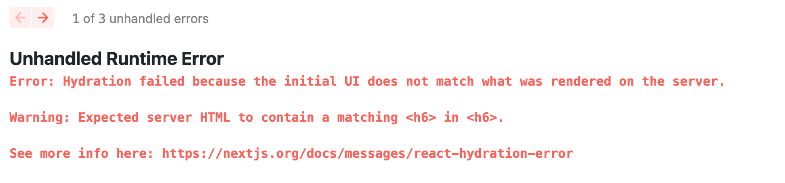
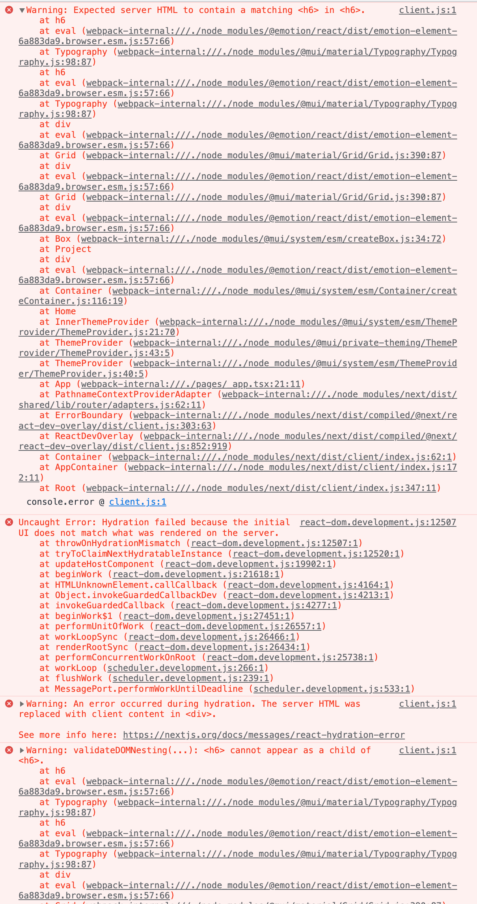

# Next.js - Hydration failed ... (ft. MUI)

## 🧶 Problem

<br>

Next.js를 사용하여 포트폴리오 작업을 하고 있었는데 다음의 에러가 발생하였다.

```
Error: Hydration failed because the initial UI does not match what was rendered on the server.

Warning: Expected server HTML to contain a matching <h6> in <h6>.

See more info here: https://nextjs.org/docs/messages/react-hydration-error
```

<br>



<br>



<br>

Next.js 홈페이지로 들어가보니 이 오류는 애플리케이션을 렌더링하는 동안 미리 렌더링된 React 트리(SSR/SSG)와 브라우저에서 첫 번째 렌더링 중에 렌더링된 React 트리 간에 차이가 있어서 발생하는 것이라는 설명이 되어 있었다. 그리고 해당 방법에 대한 예시가 나와 있어서 해당 예시에 맞춰 변경해 보았다.

<br>

## 🪄 Solution 1

<br>

```js
export default function App({ Component, pageProps }: AppProps) {
  const [mounted, setMounted] = useState(false);

  useEffect(() => {
    setMounted(true);
  }, []);

  return (
    <>
      <Head>...</Head>
      {mounted && (
        <ThemeProvider theme={theme}>
          <CssBaseline />
          <Component {...pageProps} />
        </ThemeProvider>
      )}
    </>
  );
}
```

에러가 어느 정도 해결된 것처럼 보였으나 기본적으로 MUI 테마가 제대로 적용되지 않았고 다음의 에러 하나가 남았다.

<br>

```
client.js:1 Warning: validateDOMNesting(...): <h6> cannot appear as a child of <h6>.
    at h6

```

<br>

해당 에러는 처음 발생한 수많은 에러 중 하나였는데 제대로 보지 않았었다. 해당 에러를 다시 구글링해서 찾아보니 해당 에러는 MUI에 관련된 에러였다.

다음의 페이지에서 해당 에러처리의 힌트를 얻었다.

#### [https://github.com/mbrn/material-table/issues/653](https://github.com/mbrn/material-table/issues/653)

<br>

MUI의 Typography 태그를 잘못 중첩해서 사용하면 발생하는 문제였다.

나는 에러가 나긴 전 작업을 확인하고 문제를 찾아냈다.

<br>

## 🪄 Solution 2

<br>

```js
<Typography variant="subtitle1" m={5}>
  주요 기능 : 학습하고자 하는 영어문장을 등록, 문장집(그룹)별로 구분하여 학습할
  수 있으며, 학습한 문장은 따로 체크 가능, 각각의 문장 따로 상세히 조회하여
  학습할 수 있다
  <br></br>
  <br></br>
  FrontEnd : React, NextJS, TypeScript, TailwindCSS, React Query, Recoil
  <br></br>
  BackEnd : MongoDB
  <br></br>
  Deployment : Vercel
  <br></br>
  GitHub : &nbsp;
  <Typography
    variant="subtitle1" // 중복!!!
    ...
  >
    <a href="https://github.com/Gryffindor0ne/me-moonjang">
      https://github.com/Gryffindor0ne/me-moonjang
    </a>
  </Typography>
</Typography>
```

<br>

해당 에러는 MUI 라이브러리를 사용하던 중 Typegraphy 태그를 중첩으로 사용하다가 같은 옵션을 중복으로 사용하여 발생한 에러라는 것을 알게 되었다. 해당 옵션을 삭제하고 위에서 설정한 부분도 다 삭제한 후 앱을 다시 실행해보니 에러없이 잘 작동하였다.

결국 해당 에러는 내가 SSR으로 작동하는 NextJS에서 MUI 라이브러리를 잘못 사용하여 렌더트리 오류를 발생시킨 것이 원인이었다. 어찌보면 아주 단순한 실수인데 에러가 무수하게 많이 뜨니 내심 당황하였다. 다행히 원인은 금방 찾아내어 해결하였고 그로 인해 또 한 가지 배우는 작업이 되었다.
