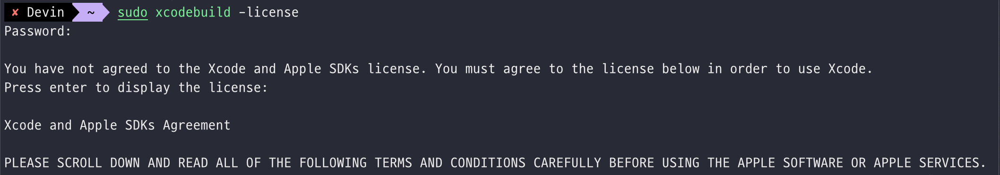

# includepath를 업데이트하세요

## 🧶 Problem

<br>

맥북에서 작업하던 중 xcode를 업데이트 하라고 알림이 와서 업데이트를 진행했다. xcode 15.0 버전으로 업데이트가 되었는데 그 후
vscode에서 C++ 작업 중 `#include <iostream>` 코드에 에러가 발생했다.

```bash
#include 오류가 검색되었습니다. includepath를 업데이트하세요.
```

## 🪄 Solution

<br>

직감으로 xcode 업데이트 문제인 듯 보였으나 정확한 것을 알 수 없어서 구글링을 시작했다.
path를 새로 지정해야 한다고 해서 해당 경로를 알기 위해 다음의 명령을 실행했다.

```bash
gcc --version
```

그러나 먼저 xcode에 대한 라이센스 동의를 하라고 나온다.

```perl
Agreeing to the Xcode and Apple SDKs license requires admin privileges, please accept the Xcode license as the root user (e.g. 'sudo xcodebuild -license').
```

<br>

명령을 실행하여 관리자 암호를 입력한 후 영어로 agree를 입력했다.



<br>

xcode에 대한 라이센스 등록이 완료되면 다시 위의 명령을 실행시킨다.


<br>

InstalledDir에 있는 path를 복사한 후

```bash
/Applications/Xcode.app/Contents/Developer/Toolchains/XcodeDefault.xctoolchain/usr/bin
```

<br>

vscode의 .vscode 폴더의 c_cpp_properties.json 파일의 includePath 부분에 경로를 추가해준다.

```c
{
  "configurations": [
    {
      "name": "macos-clang-x64",
      "includePath": [
        "${workspaceFolder}/**",
        "/Applications/Xcode.app/Contents/Developer/Toolchains/XcodeDefault.xctoolchain/usr/bin"
      ],
      "compilerPath": "/usr/bin/gcc",
      "cStandard": "${default}",
      "cppStandard": "${default}",
      "intelliSenseMode": "macos-clang-x64",
      "compilerArgs": [""]
    }
  ],
  "version": 4
}
```

path를 지정하면 해당 내용의 에러가 사라진다.

 <br>

---

## 참고 🫧

#### [[오류 디버깅] 맥에서 vscode includePath를 찾을 수 없습니다.](https://velog.io/@guri_coding/%EC%98%A4%EB%A5%98-%EB%94%94%EB%B2%84%EA%B9%85-%EB%A7%A5%EC%97%90%EC%84%9C-vscode-includePath%EB%A5%BC-%EC%B0%BE%EC%9D%84-%EC%88%98-%EC%97%86%EC%8A%B5%EB%8B%88%EB%8B%A4)
